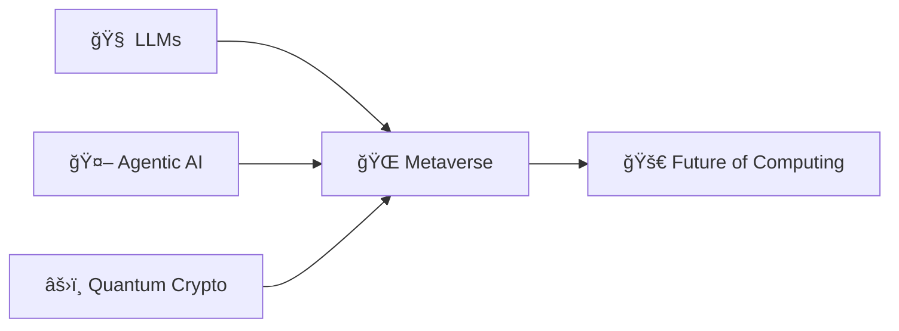

<div align="center">

# 🌟 Welcome to My Digital Universe! 🌟


[](https://git.io/typing-svg)


### 🎓 **Integrated M.Tech Software Engineering @ VIT Vellore**

<p align="center">
  
  
  
  
  
</p>

### 🚀 *Transforming Data, Vision, and Intelligence into Revolutionary Innovation*


[](https://github.com/dhanushkonduru)
[](https://github.com/dhanushkonduru)

</div>

---

## 🧠 About Me  

<table>
<tr>
<td width="50%">

### 👨‍💻 **Who I Am**

- 🎓 **Integrated M.Tech Student** specializing in Software Engineering at VIT Vellore
- 🤖 **AI/ML Engineer** with expertise in building intelligent, production-ready systems
- 🧠 **Agentic AI Researcher** exploring autonomous agents and LLM-powered applications
- 🌐 **Metaverse Innovator** crafting immersive VR experiences with cutting-edge technology
- ⚛️ **Quantum Security Enthusiast** pioneering next-gen cryptographic solutions

</td>
<td width="50%">

### 🎯 **What I'm Building**

- 🔬 **LLM Fine-Tuning Systems** using LoRA for efficient model adaptation
- 🤝 **Agentic AI Frameworks** enabling autonomous decision-making agents
- 🌌 **Metaverse VR Platforms** merging AI with immersive 3D environments
- 🔐 **Quantum Cryptography Solutions** for ultra-secure data transmission
- 📊 **RAG Pipelines** for intelligent document retrieval and analysis

</td>
</tr>
<tr>
<td width="50%">

### 💡 **My Expertise**

- 🎯 **Computer Vision**: CNN-based object detection, image processing, autonomous systems
- 🧠 **NLP & LLMs**: Prompt engineering, RAG, vector databases, LangChain
- 🏗️ **Full-Stack Development**: Django, Flask, Node.js, REST APIs
- ☁️ **Cloud Architecture**: AWS, Azure, Docker, scalable deployments
- 📈 **Data Science**: Predictive modeling, statistical analysis, visualization

</td>
<td width="50%">

### 🚀 **Current Focus**

- 📚 Mastering **LangChain** for agentic workflows and orchestration
- 🧪 Experimenting with **Generative AI** and multimodal models
- 🎮 Developing **real-time 3D simulations** for Metaverse applications
- 🔗 Contributing to **open-source AI/ML** projects
- 💬 Mentoring aspiring developers in AI/ML domains

### 🏆 **Achievements**

- 💡 **10+ AI/ML Projects** deployed and documented
- 🎓 **6+ Premium Certifications** from Coursera, NVIDIA, Google
- 🏅 **Gen-AI Hackathon** - Certificate of Excellence
- 🌟 Active contributor to the **AI/ML community**

</td>
</tr>
</table>

---

## 🛠 Tech Stack & Arsenal  

<div align="center">


</div>

<details open>
<summary><b>💻 Programming Languages</b></summary>
<br>


</details>

<details open>
<summary><b>🧠 AI/ML & Deep Learning</b></summary>
<br>


</details>

<details open>
<summary><b>🧩 Frameworks & Libraries</b></summary>
<br>


</details>

<details open>
<summary><b>🗄️ Databases & Vector Stores</b></summary>
<br>


</details>

<details open>
<summary><b>☁️ Cloud & DevOps</b></summary>
<br>


</details>

<details open>
<summary><b>🧰 Tools & IDEs</b></summary>
<br>


</details>

<div align="center">

</div>

---

## 🚀 Featured Projects Portfolio  

<div align="center">

</div>

<table>
<tr>
<td width="50%" valign="top">

### 🧠 [AskMyPDF](https://github.com/dhanushkonduru/askmypdf)
<a href="https://github.com/dhanushkonduru/askmypdf">

</a>

```yaml
Type: AI/ML Application
Stack: LangChain, Qdrant, OpenAI
Features:
  - RAG Pipeline Implementation
  - Context-Aware NLP Retrieval
  - Vector Database Integration
  - Real-time Document Q&A
```

**🎯 Impact:** Revolutionizing document interaction with AI-powered intelligent retrieval

</td>
<td width="50%" valign="top">

### 🧬 [Quantum Video Encryption](https://github.com/dhanushkonduru/Video-Encryption-using-Quantum-Cryptography)
<a href="https://github.com/dhanushkonduru/Video-Encryption-using-Quantum-Cryptography">

</a>

```yaml
Type: Research & Security
Stack: Python, Quantum Algorithms
Features:
  - Quantum Key Distribution (QKD)
  - Frame-Level Encryption
  - Quantum Measurement Based
  - Ultra-Secure Video Sharing
```

**🎯 Impact:** Next-gen security for multimedia content transmission

</td>
</tr>

<tr>
<td width="50%" valign="top">

### 🚗 [Autonomous Lane Detection](https://github.com/dhanushkonduru)
<a href="https://github.com/dhanushkonduru">

</a>

```yaml
Type: Computer Vision
Stack: OpenCV, TensorFlow, CNN
Features:
  - CNN-Based Detection
  - Real-Time Processing
  - ADAS Integration
  - Multi-Condition Support
```

**🎯 Impact:** Enhancing autonomous vehicle safety systems

</td>
<td width="50%" valign="top">

### 🛒 [E-ComConnect](https://github.com/dhanushkonduru/E-ComConnect)
<a href="https://github.com/dhanushkonduru/E-ComConnect">

</a>

```yaml
Type: Full-Stack Web App
Stack: Django, SQLite, JavaScript
Features:
  - OTP Authentication
  - Product Management System
  - Order Processing Pipeline
  - Responsive UI/UX
```

**🎯 Impact:** Streamlining online commerce experiences

</td>
</tr>
</table>

<div align="center">

### 🌟 More Projects Coming Soon! 🌟

[](https://github.com/dhanushkonduru?tab=repositories)

</div>

---

## 🏆 Certifications & Achievements  

<div align="center">

</div>

<table>
<tr>
<td width="50%">

### 🎓 **Machine Learning & AI**

| Certification | Issuer | Badge |
|--------------|--------|-------|
| Machine Learning Specialization | Andrew Ng (Coursera) | 🏅⭐⭐⭐⭐⭐ |
| Supervised ML: Regression & Classification | Coursera | 🏅⭐⭐⭐⭐⭐ |
| Fundamentals of Deep Learning | NVIDIA | 🏅⭐⭐⭐⭐ |
| Prompt Engineering for ChatGPT | Vanderbilt University | 🏅⭐⭐⭐⭐ |

</td>
<td width="50%">

### ☁️ **Cloud & Infrastructure**

| Certification | Issuer | Badge |
|--------------|--------|-------|
| Google Cloud Digital Leader Training | Google Cloud | 🏅⭐⭐⭐⭐ |

### 🥇 **Competitions & Honors**

| Achievement | Details | Badge |
|------------|---------|-------|
| Hackathon Gen-AI | Certificate of Excellence | 🏆⭐⭐⭐⭐⭐ |

</td>
</tr>
</table>

<div align="center">


</div>

---

## 📊 GitHub Analytics & Statistics  

<div align="center">


</div>

<div align="center">
  
  
</div>

<div align="center">
  
</div>

<div align="center">
  
</div>

<div align="center">
  
### 🏆 GitHub Trophies
  
[](https://github.com/ryo-ma/github-profile-trophy)

</div>

<div align="center">

### 📈 Contribution Metrics


</div>

<div align="center">

</div>

---

## 🌐 Metaverse Vision & Future Roadmap  

<div align="center">


</div>

<table>
<tr>
<td width="33%" align="center">

### 🌍 **Immersive Worlds**
Building next-gen **Metaverse VR Systems** where reality meets imagination


</td>
<td width="33%" align="center">

### 🤖 **Agentic AI**
Creating **intelligent digital agents** that seamlessly interact with humans


</td>
<td width="33%" align="center">

### ⚛️ **Quantum Security**
Implementing **quantum-secure architecture** for ultra-safe systems


</td>
</tr>
</table>

<div align="center">

### 🎯 **Core Research Areas**



**🔮 Vision:** *Pioneering the convergence of AI, VR, and Quantum Computing to create intelligent, secure, and immersive digital universes*

</div>

---

## 📢 Let's Connect & Collaborate!  

<div align="center">


### 💬 **I'm Always Open To:**
🚀 Innovative Project Collaborations | 🧠 AI/ML Research Discussions | 🌐 Open Source Contributions | 💡 Tech Talks & Mentorship

<br>

[](https://www.linkedin.com/in/dhanush-konduru-aa9574229/)
[](https://github.com/dhanushkonduru)
[](mailto:dhanushkonduru@gmail.com)
[](https://github.com/dhanushkonduru)

<br>

### 💌 **Drop a Message!**

<a href="mailto:dhanushkonduru@gmail.com">

</a>

</div>

---

<div align="center">


### ⚛️ *Crafted with Code, Curiosity, and Quantum Precision* ⚛️


**✨ "The future belongs to those who believe in the beauty of their dreams and the power of their code." ✨**

<br>


</div>
